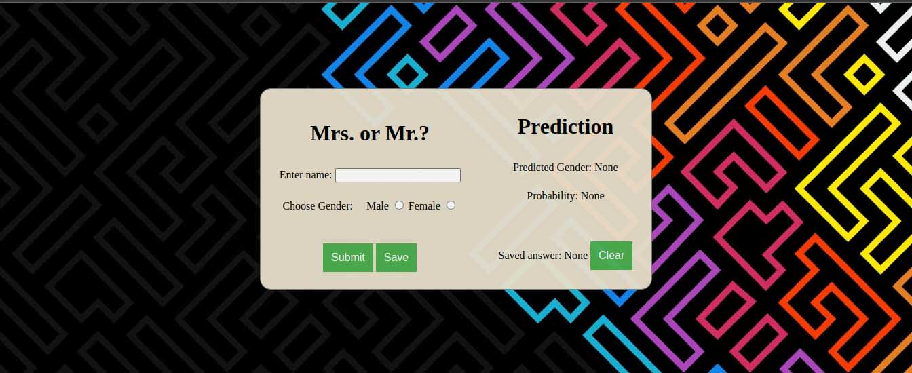

## Guess Gender

[This website](https://mahdirezaie336.github.io/GuessGender) helps to find gender of a name. 

Usually in online classes we see some names that we don't know they belong to a male or female. Using this website, we can find out their gender.

## How to use?
To use this website just click on this link:

[https://mahdirezaie336.github.io/GuessGender](https://mahdirezaie336.github.io/GuessGender)

This is a preview of the webpage:

There is a field in which you can enter the name. Just type and click submit. On the right fields you can see the result.

## Save

If we guess the gender wrong you can use radio buttons to choose the gender you want, the click on save.
By doing this you can save whatever result you want.

If you wanted to save what we have predicted, just click save button after prediction.

## Developers

This project is completely done by [me](https://github.com/mahdirezaie336).
